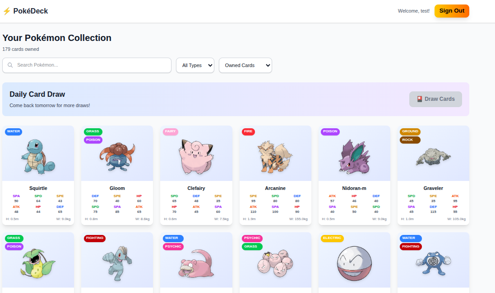

# Poke Deck

A Pokémon card collection application built with Next.js and Express.js.



## Features

- Browse and collect Pokémon cards with detailed information
- Secure passwordless login system
- Collect new Pokémon cards daily
- Easy deployment with Docker and Docker Compose

## 🚀 Quick Start

### Prerequisites

- Docker and Docker Compose installed
- Git

### Setting Up Local Development Environment

1. **Clone the repository**

   ```bash
   git clone https://github.com/fcendesu/poke-deck.git
   cd poke-deck
   ```

2. **Start development environment**

   ```bash
   docker compose -f docker-compose.dev.yml up --build
   ```

3. **Create database and store**

   ```bash
   cd backend
   npm install
   npm run db:generate
   npm run:migrate
   # Initialize Pokemon data from PokeAPI
   npm run db:init-pokemon
   ```

   ```bash
   cd frontend
   npm install
   ```

4. **Additional development tools**

- MailHog server is running at port 8025
- Access Drizzle Studio by running npm run db:studio and visiting local.drizzle.studio

# Key Decisions

### Tech Stack:

- **Frontend**: Using **Next.js** as it's the framework I'm most confident with.
- **Backend**: **Express** with **TypeScript**, to keep the project consistent and improve development speed by using a single language throughout.
- **Database**: **PostgreSQL**, chosen for its performance and scalability. I'm using **Drizzle ORM** because it's lightweight, fast, and familiar.
- **Mail**: Integrated **MailHog** for local testing. This will be replaced with a production-ready solution in deployment environments.

### Authentication

Magic link authentication server from scratch.

Implemented server-side cookies as the token storage method.

## Project Demo


